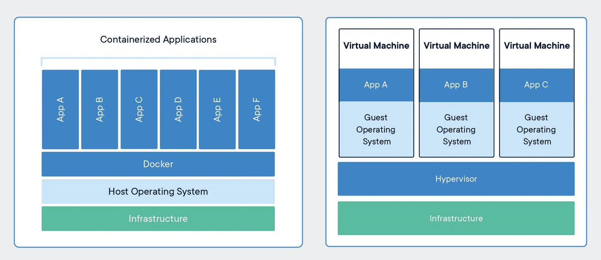
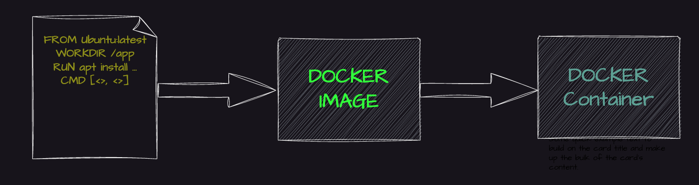

# Hands on

- Launched an ec2 instance and downloaded docker on that ec2 instance
- Containerized a simple python application by building a docker image for the python app
- Pushed and pulled image from personal docker registry account

# What is a container?

- **lightweight**, standalone, executable package of software/application
- Includes everything that is needed to run an application (code, runtime, dependencies, libraries, etc)

# Container vs Virtual Machines

- Both are used to isolate applications but they they have differences:

  1. Resource Utilization - Containers share OS kernel, ligher and faster. VMs have a full-fledged OS on top of a hypervisor, more resource instensive
  2. Portability - Containers are designed for portability and can run on any system witha compatible host OS. VMs are less portable they need a compativle hypervisor to run
  3. Security - VMs have higher security since they each have their own OS, therefore better isolation. Containers provide less isolation, share OS.
  4. Management - Managing containers easier > managing VMs

### Anology

- Containers = Food Trucks
  - In a festival, one food truck shares resources with other food trucks (water, eletricity -> sharing OS)
  - Can easily set up food truck in another festival, therefore light weight and portable
  - Additionally, a **base image** can be seen as the bare minimum required to run the food stand (gathering utensils, pots, pans, etc)
  - However, each food truck serves very distinct food (tacos, pizza, burger -> python, node.js, java)
- VMs = Restaurants
  - Doesn't share resources with other restaurants and needs a lot more resources/heavier such as tables and chairs
  - Each restaurant operates as an independent entity (more isolation)
  - Much easier to move a food truck than to move a restaurant (less portable)

### Files and folders in base image (unique to each container)

    /bin: contains binary executable files, such as the ls, cp, and ps commands.

    /sbin: contains system binary executable files, such as the init and shutdown commands.

    /etc: contains configuration files for various system services.

    /lib: contains library files that are used by the binary executables.

    /usr: contains user-related files and utilities, such as applications, libraries, and documentation.

    /var: contains variable data, such as log files, spool files, and temporary files.

    /root: is the home directory of the root user.

### Files and folders containers use from host OS

    The host's file system: Docker containers can access the host file system using bind mounts, which allow the container to read and write files in the host file system.

    Networking stack: The host's networking stack is used to provide network connectivity to the container. Docker containers can be connected to the host's network directly or through a virtual network.

    System calls: The host's kernel handles system calls from the container, which is how the container accesses the host's resources, such as CPU, memory, and I/O.

    Namespaces: Docker containers use Linux namespaces to create isolated environments for the container's processes. Namespaces provide isolation for resources such as the file system, process ID, and network.

    Control groups (cgroups): Docker containers use cgroups to limit and control the amount of resources, such as CPU, memory, and I/O, that a container can access.

# What is Docker?

- Docker is a containerization platform (A technology) that provides an easy way to containerize your application.
- Docker LifeCycle:
  1. docker build -> build docker images from Dockerfile
  2. docker run -> runs container from docker images
  3. docker push -> push the container image to public/private registries to share the docker images

### Docker Deamon

- Listens for docker API requests and manages Docker objects such as images, containers, networks and volumes
- Sort of like the intermediate brain of Docker that we communicate to through the Docker CLI

### Docker Client

- Sends the commands to the Docker Daemon
- It doesn't do any of the heavy lifting (Client and daemon communicate using a REST API)

### Docker Images

- Read-only template with instructions for creating a Docker container
- They are immutable (just like EC2 AMI), you can only create new versions of it, cannot modify existing ones

### Docker Registries

- Place to store Docker Images
- Docker hub is a public registry that anyone can use, Docker is configured to look for images on Docker Hub by default
- Additionally, Docker Hub -> version control for your images
