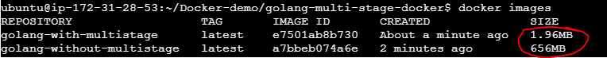

# Hands on

- Deployed a simple golang calculator with and without docker multi stage builds
- Multi stage was able to reduce the image size from 656 MB -> 1.96 MB
- The drastic difference is due to the nature of go lang -> self-contained binaries -> No runtime env
- results:

# What is Multi Stage docker builds?

- Allows you to create more efficient images by seperating the build and runtime env
- Makes containers even more light weight by just including the most minimalistic dependencies required to run your application
- Anology
  - think of it as a space craft with a booster launching to space
  - The booster is the base image (build dependencies)
  - The top of the space craft is the "final image"
  - The booster helps the space craft to reach space and is then DETACHED -> making the space craft even more light weight
- Benefits:
  - Smaller image size
  - Better security
  - Cleaner and faster builds

## distroless image

- It is basically thee final most minimalistic docker image required to run an application
- Smaller, more secure and highly optimized for production environments
