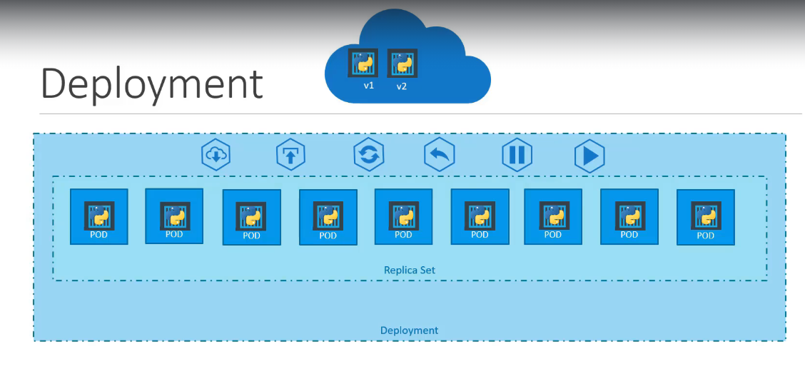
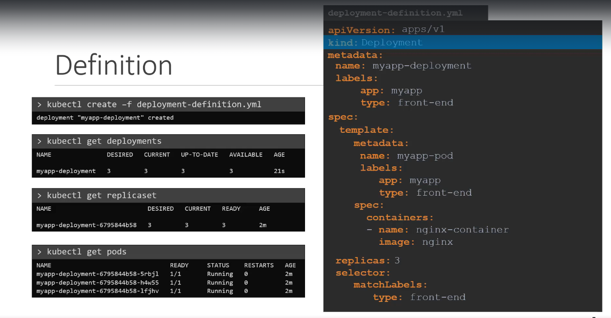

# Deployments

- Provides declarative updates for pods and replicasets
- Create and manage replicasets
- Key features:
  - **Rolling updates** -> gradually removing old pods and replacing them with new ones, as it ensure zero down time
  - **Roll back** -> if something goes wrong, roll back to previous replicasets, safer for production
- **Note** -> under `kind` it needs to be `Deployment` capital D

- `kubectl get all` -> to see all the created objects at once
- `k create deployment <NAME> --image=<image name> --replicas=<number>` -> creates a deployment with the specified parameters without a yaml file
