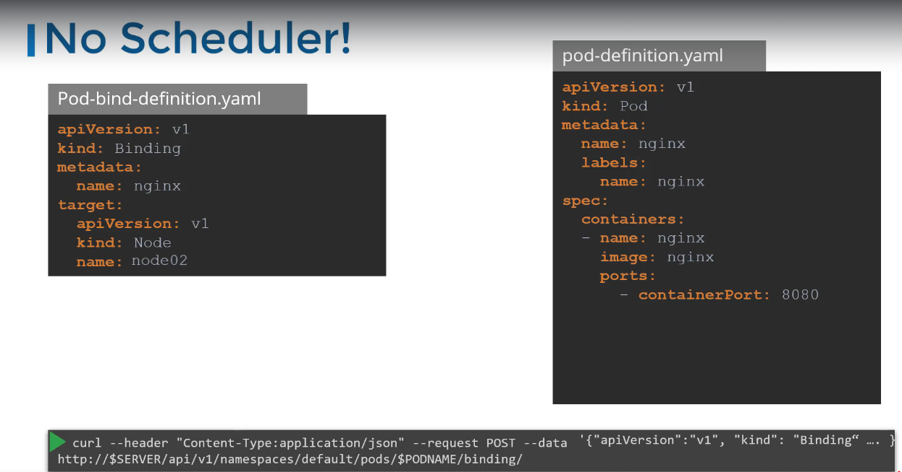

# Manual scheduling

- What do you do when you do not have a scheduler in your cluster?
- To check if you have scheduler
  - `k get pods --namespace=kube-system`
- By default, every pod has a field in the `spec` called `nodeName`, kubernetes adds it automatically
- The `nodeName` field is responsible for binding the pod to a particular node
- Two methods to schedule the pod

  - Polulate the `nodeName` in **creation time** the `nodeName` can only be populated during creation time. Therefore, if you want to change using this method, make sure to recreate the pod
    - Use `k replace --force -f <yaml file>` to delete and recreate pod in new node
  - If pod already created, create a **Binding object** shown below:

  
