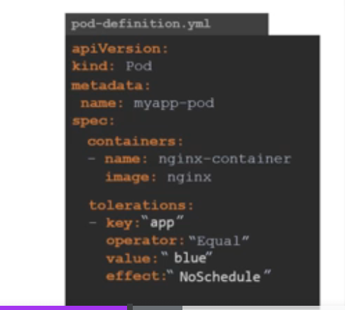

# Taints & Tolerant

- **Taints** - Think of taints as a person who has sprayed bug spray on himself (**Nodes**)
- **Tolerant** - Think of a bug (**pods**) and it's tolerance towards the bug spray, some bugs will be intolerant and will not land on the person, but other bugs might be more tolerant and will still land on the person
- Taints and tolerance has nothing to do with security and intrusion
- Used to set restrictions on what pods can be scheduled on a node
- Taints are set on nodes and tolerations are set on pods

### Commands

- To taint a node
  - `k taint node <node name> key=value:taint-effect`
    - The `taint-effect` is what happens to PODS that do not tolerate thet taint three options -> `NoSchedule | PreferNoSchedule | NoExecute`
    - `NoSchedule` -> Don't schedule the pod
    - `PrefereNoSchedule` ->
- Adding tolerations to the pod
  

**NOTE** -> Taints and Tolerations does not tell the pod where to go, it only says that tainted nodes will only accept pods with certain tolerations. Therefore it does not gurantee where the node will end up in.

**Taint in Master Node/Control Plane** -> By default, a taint is set on the master node to prevent any nodes to being scheduled on the master node
