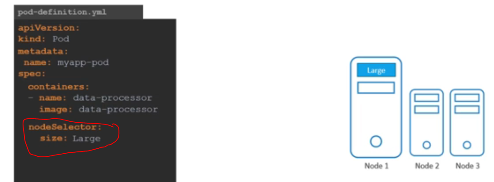
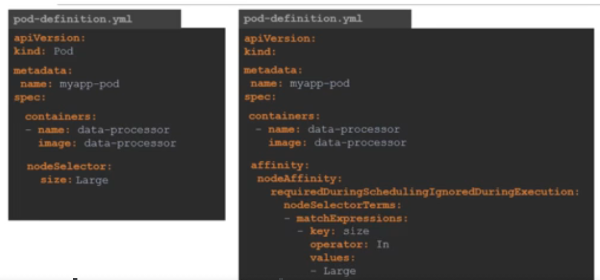

# Node Selector

- Allows us to define conditions within a pod to limit what kind of node it ends up in
- They have the same concept as labels and selectors

- e.g. below is the definition file for a pod that has a `nodeSelector` of a key value pair of `size=Large`, which means that this pod will only chooses to land up in nodes that have this label

  

- Command for labelling nodes:
  - `k label nodes <node-name> <key=value>`

### Limitations of Node Selectors

- What if we want some condition like:
  - Place a pod on a `large` OR `medium` node?
  - Place a pod on node whic is NOT `small`
- Not possible with node selectors
- They do not allow complex logical operators

# Node Affinity

- Allows for logical operations
- Syntax:
  
- Operators could have values like:
  - `NotIn`
  - `In`
  - `Exists`

### Node affinity Types

- Defines the behaviour lifecycle of the node affinity
  - `requiredDuringSchedulingIgnoredDuringExecution`
    - `requiredDuringScheduling` -> Strict, meaning if no labels matched with any nodes, no scheduling
    - `IgnoredDuringExecution` -> For the pods that are already scheduled, changes in the affinity rules of the node does not affect the existing pods
  - `preferredDuringSchedulingIgnoredDuringExecution`
    - `preferred` -> Not strict, if it's possible schedule it to nodes with those conditions, if not schedule it some where else
