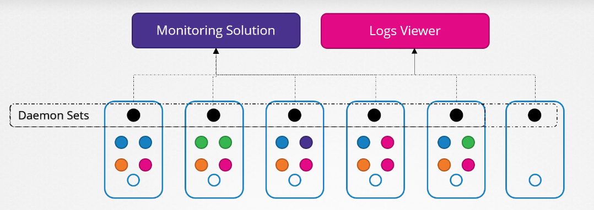
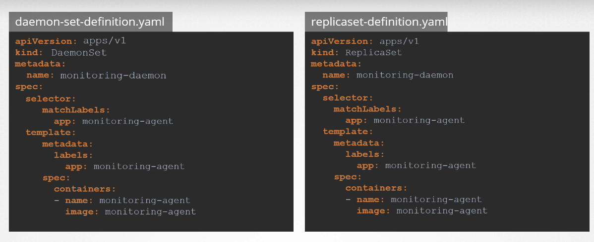

# Deamon Sets

- Ensures that there is always one pod in each node, All the pods together are known as the deamon set
- Use case:

- **Kube-Proxy** is also a great use case for deamon Set

- Definition file is very similar to replica set:
  

- **Note** - There is no such command `k create daemonset ....`, will first need to create deployment using `k create deployment ...` with dryrun and then modify the file
