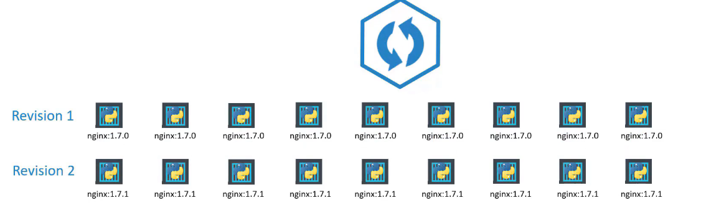
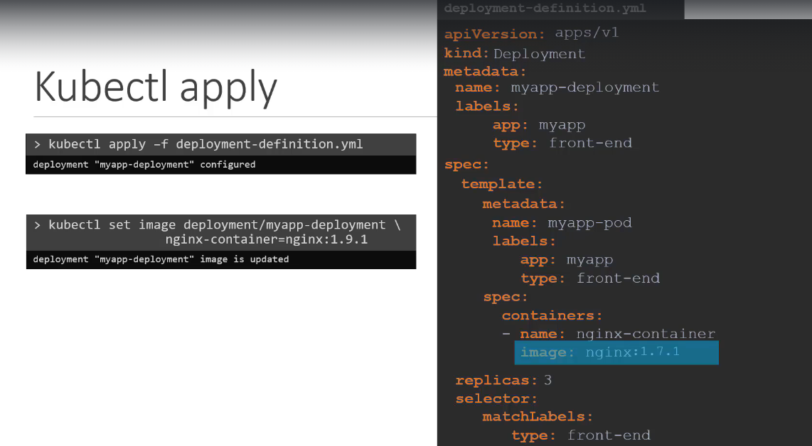
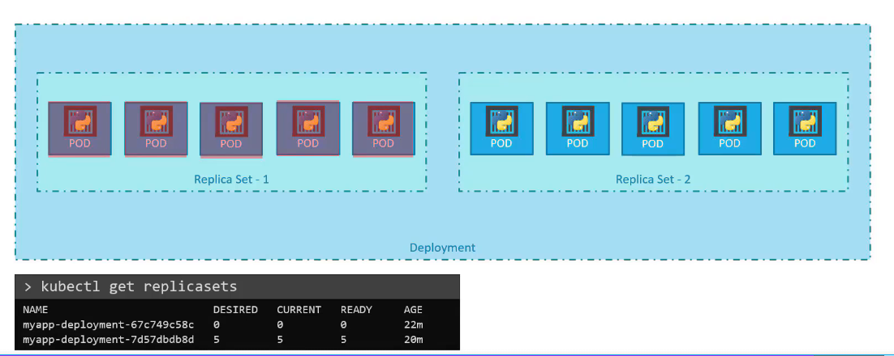
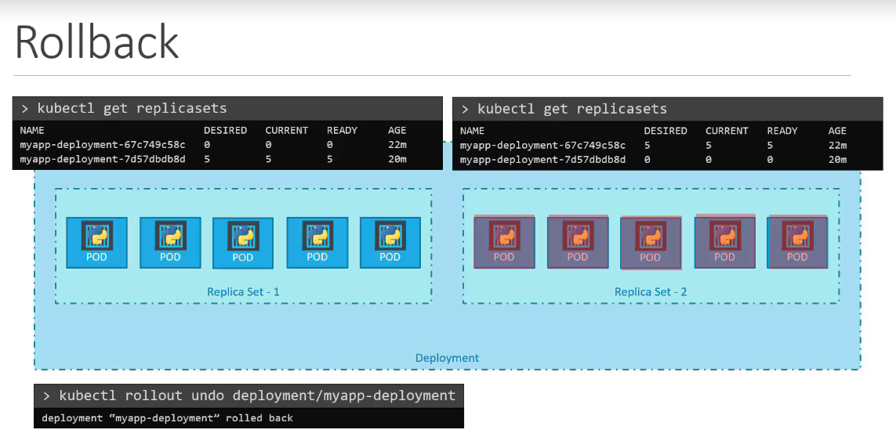

# Rollout and Versioning

- Creating a deployment -> Triggers a rollout -> creates a new revision (basically a version)
- When container updated -> Triggers a new rollout -> creates a new revision

- Rollout command
  - `k rollout status deployment/myapp-deployment` -> status of rollouts
  - `k rollout history deployment/myapp-deployment` -> history of rollouts

# Deployment Strategy

- **Recreate**
  - Destroy all the containers
  - Relaunch all the containers
  - CONS -> There is an application down time
- **Rolling update** -> Default deployment strategy

  - Take down an old one, replace with new one
  - One by one

- How to update/upgrade:
  

  

  
