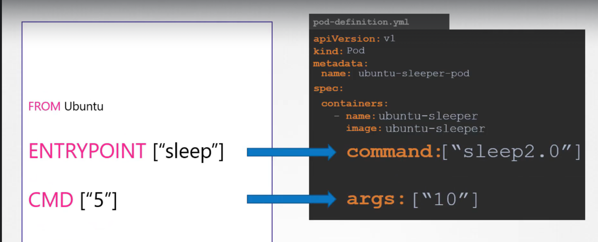

# Application Commands, Arguements

- Unlike VMs, container are not meant to host an OS, it is meant for a specific task/process
  - When process done running, it shuts down
- That's why we use the **Sleep command** to keep the program alive
- Docker:

  - `docker run ubuntu sleep 5` -> runs the ubuntu image and then waits for 5 seconds before shutting down
  - `ENTRYPOINT ["sleep"]` -> appends sleep to command line
  - `CMD["5"]` -> Default value of 5 on start time
  - `docker run --entrypoint sleep2.0 ubuntu-sleeper 10` -> overwrites the entry point

- In Kubernetes:
  

  - The `ENTRYPOINT` in Dockerfile is overwritten by `command` in k8
  - The `CMD` in Dockerfile is overwritten by `args` in k8
