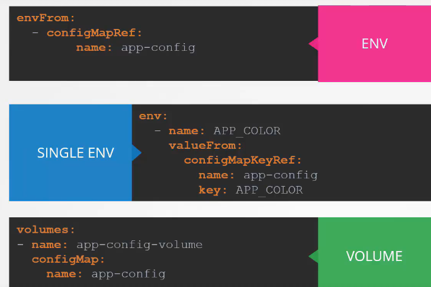

# Environment Variables

- How to set env variables:
  

## Config Maps

- Used to store and pass configuration data in the form of key value pairs

- How to create a config map
  - Imperative:
    
  - Declarative:
    
- Creating a pod and pulling data from config map
  
  
