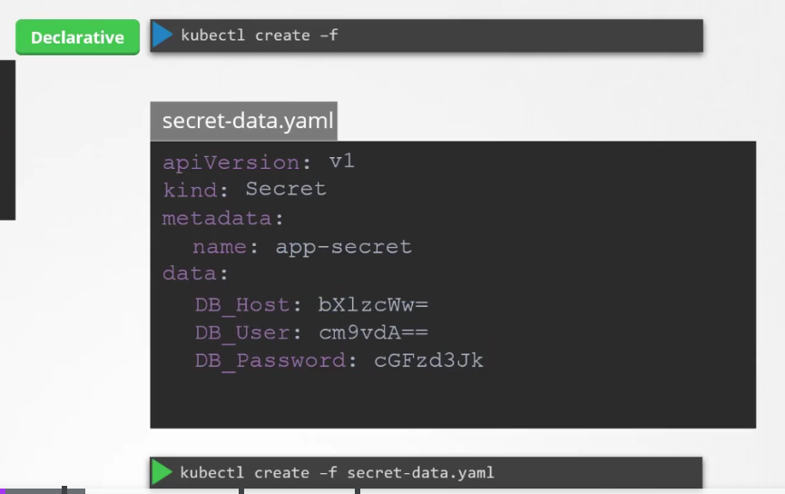
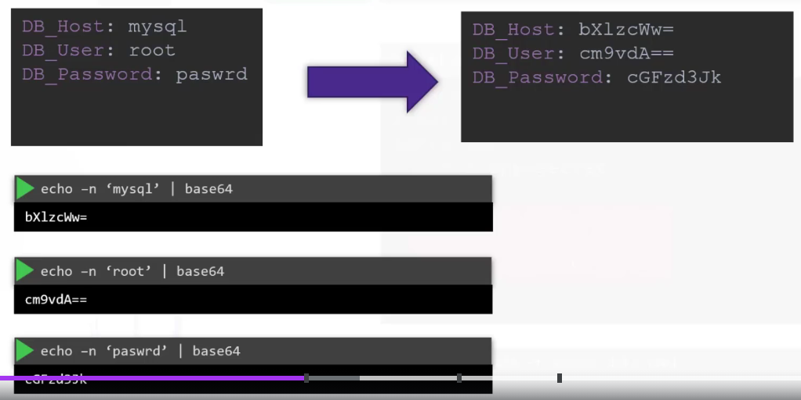
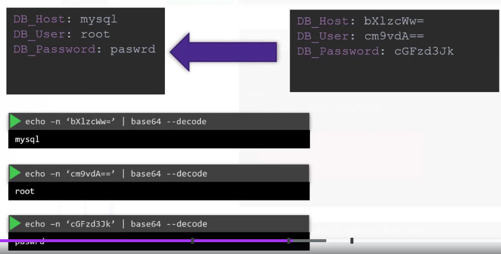
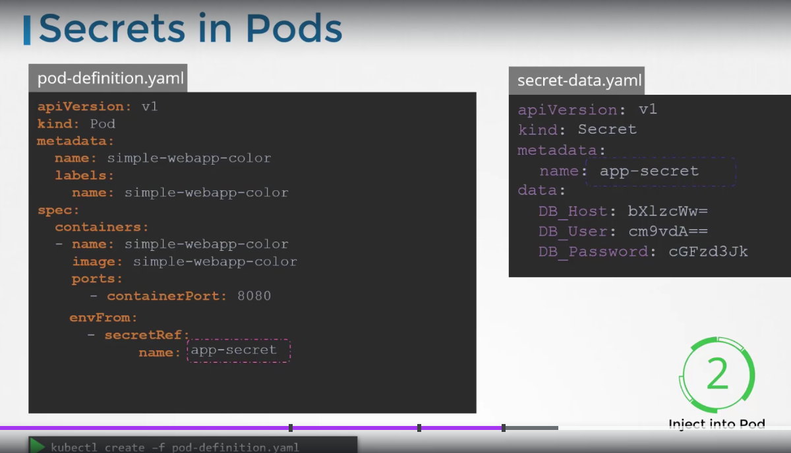
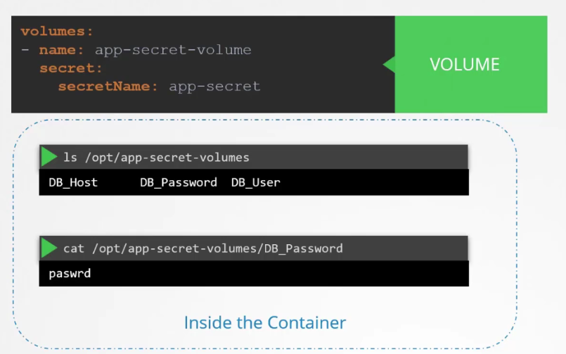

# Secrets

- Used to store sensitive info (e.g. username, passwords)
- Similar to config maps BUT **Encrypted**

### How to use Secrets

- Imperative

  - `k create secret generic <secret-name> --from-literal=<key>=<value>`
  - `k create secret generic <secret-name> --from-file=<path-to-file>`

- Declarative
  - 
- Encode
- 
- Decode
- 
- Using the secrets in pods
- 
- Secrets in Pods as Volumes
- 

- Note:
  - Secrets are not encrypted, only encoded
  - Secrets are not encrypted in ETCD
  - Configure least-privilege access to secrets - RBAC(Role base access control)
  - Consider third-party secrets store providers
