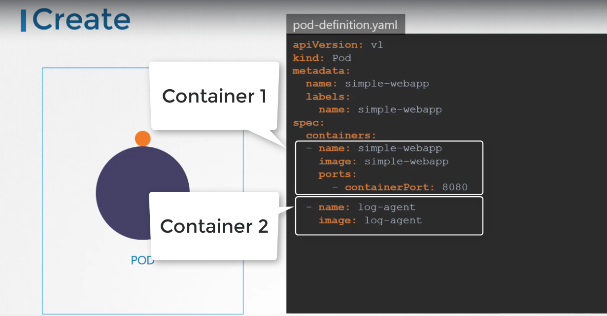

# Multi Container

- When multiple containers pods that share the same lifecycle:
  - Created/Destroyed together
  - Same network space
  - Sharing storage
  - Expected to have a process staying alive in both the containers



### init containers

- Initialization container inside a container
- Ran when the container is first created
- It is possible to run multiple init containers one at a time in sequential order
- e.g. of init in a pod

```yaml
apiVersion: v1
kind: Pod
metadata:
  name: myapp-pod
  labels:
    app: myapp
spec:
  containers:
    - name: myapp-container
      image: busybox:1.28
      command: ["sh", "-c", "echo The app is running! && sleep 3600"]
  initContainers:
    - name: init-myservice
      image: busybox:1.28
      command:
        [
          "sh",
          "-c",
          "until nslookup myservice; do echo waiting for myservice; sleep 2; done;",
        ]
    - name: init-mydb
      image: busybox:1.28
      command:
        [
          "sh",
          "-c",
          "until nslookup mydb; do echo waiting for mydb; sleep 2; done;",
        ]
```
