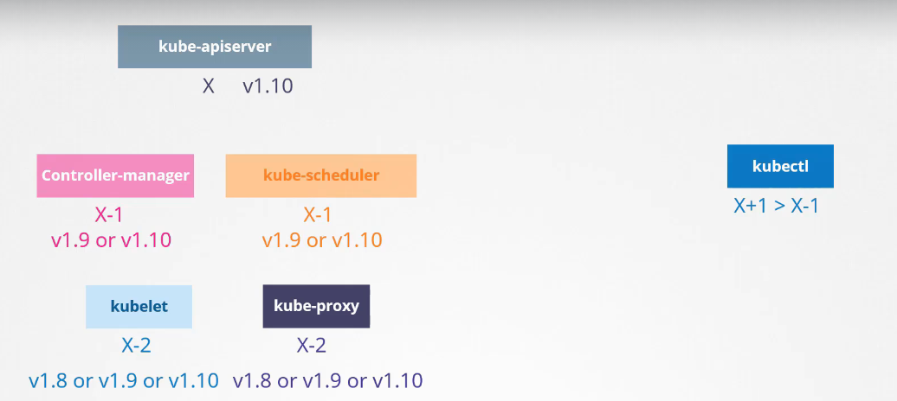

# Cluster Updates

- It is not necessary for all the core components to have the same versions, they can be at different release versions
- Since **Kube-apiserver** is the primary component that communicates with all other components, no components should be at a version higher than the kube-api server - Only the **kubelet** can be at a version higher than the kubeapi server
  
- The recommended way of updating is through one minor version at a time
  
