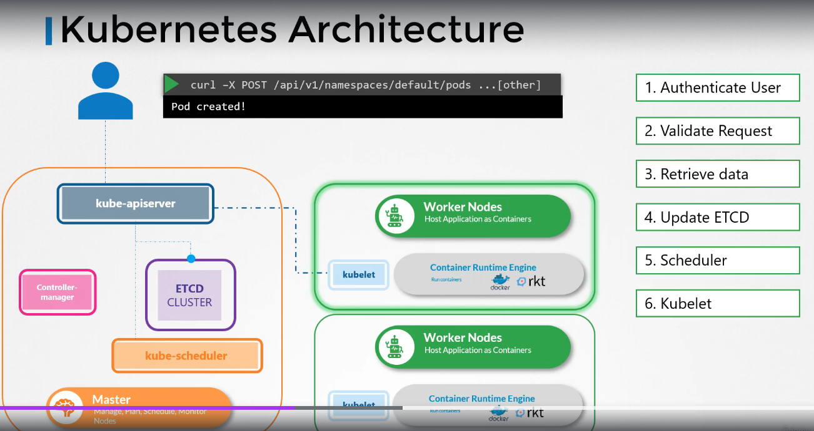

# Kube APIserver

- Kubernetes API Server is the central component of the kubernetes control plane
- Acts as the main interface for managing the entire cluster
- RESTful API server that validates and processes all requests to the cluster
- It is the only component that **Directly** interacts with ETCD database (database ONLY modified when a change is made)
- when we use the `kubectl` command line it **indirectly** uses the Restful API by translating it to RESTful API request
- You can **directly** use it by like `POST` methods:
  - `curl -X POST /api/v1/namespaces/default/pods ...`
- When you send an API request the following happens:

- Order of the work flow:

  - When we invoke an API request such as `kubectl get pods`
  - API server validates the request (properly authenticated, policy-compliant, well-formed requests, etc)
  - Writes **desired state** to etcd
  - **Scheduler** continuously watches and monitors for unscheduled pods by querying the API server
  - API server then updates teh etcd with the scheduling info (e.g. chosen node)
  - **kubelet** similarly monitors the API server for any pods scheduled to it
  - If it detects that a pod has been scheduled to it, it pulls the necessary container images and starts the container
  - Finally, it reports back to the API server (e.g. running)
  - API server updates the etcd actual state of the pod

- View api-server - kubeadm
  - `kubectl get pods -n kube-system`
- View api-server - non kubeadm
  - `cat /etc/systemd/system/kube-apiserver.service`
- View running process
  - `ps -aux | grep kube-apiserver`
