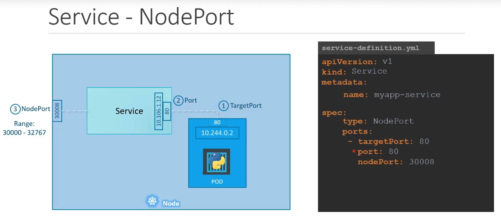
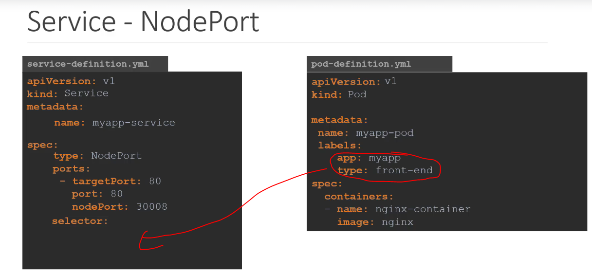
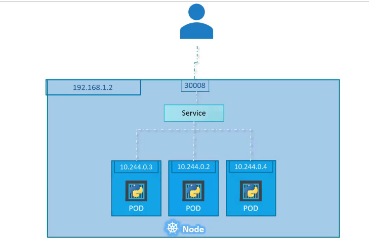
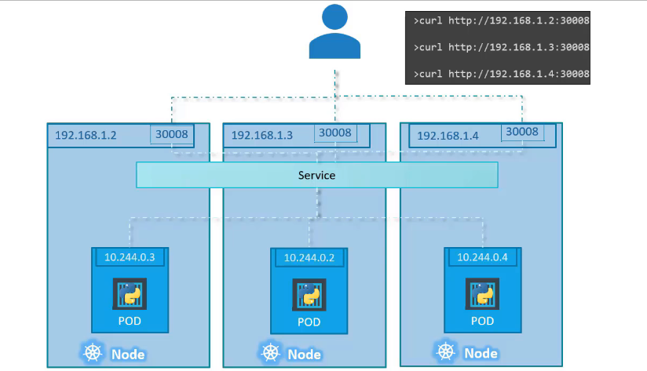
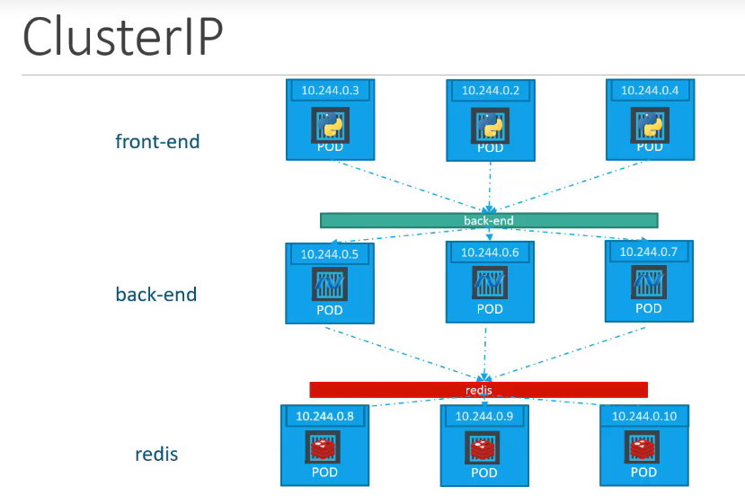
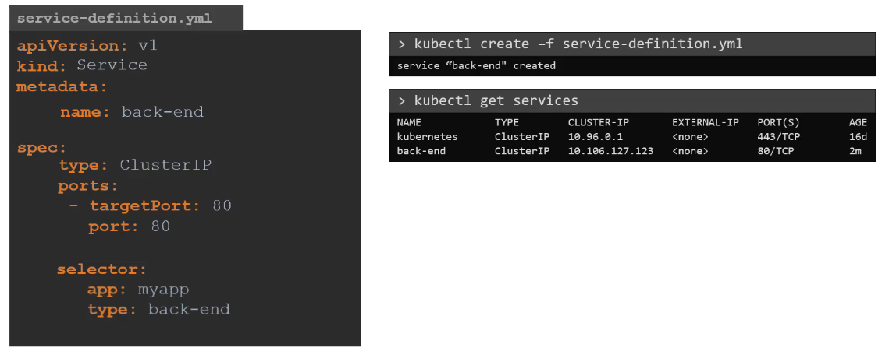
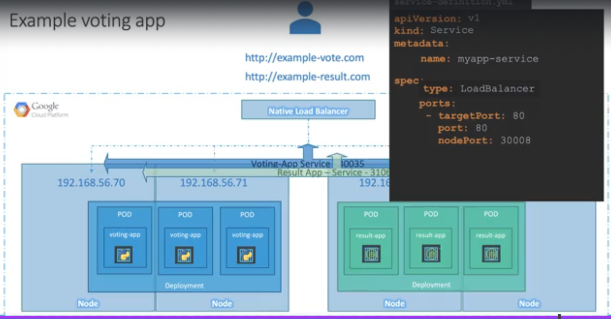

# Services

- Abstraction for a **logical(selectors) set of Pods** and provides a stable endpoint for accessing them
- Acts as endpoints for exposing applications running on a set of Pods within or outside the kubernetes cluster
- Default, each service is assigned a stable **IP address (ClusterIP)**

### Services types

#### Node-Port-service

- Service listens to a port on the node
- The service is like a virtual server inside the node

- If you don't provide a port for `nodePort`, by default it will have a value between 30000 - 32767
- Notice that `ports` is an list
- From the above diagram, we did not mention which pod the service is acting as a service to -> **Selector**
- **Selector** -> All the pods with the same labels as the selector will use the same service

- All the pods that share the same labels as the selectors will serve as endpoints. (random load balancing built in)

**Multiple pods in a single Node**

**Multiple nodes with single pods**

**NOTE**: Regardless of what your architecture is the service typically takes care of it for you once it is set up.

#### Service Cluster IP

- You need a consistent endpoint that let's the group of pods communicate with each other
- e.g. below, the backend IPs might constantly change due to scaling, therefore the service keeps the endpoint consistent

#### Service Load Balancer

#### Commands

- Create a service named redis-service to type ClusterIP to expose pod redis on port 6379
  - `k expose pod redis --port=6379 --name redis-service --dry-run=client -o yaml`
