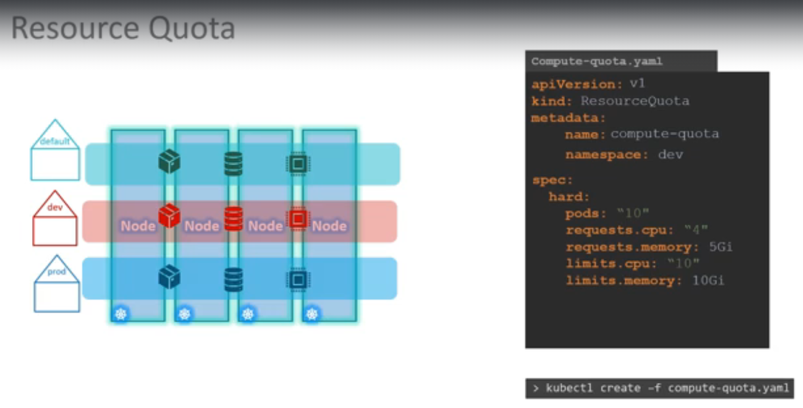

# Namespaces

- Virtual cluster or logical partition within a physical kubernetes cluster
- Isolate resources (Pods, Services and ConfigMaps) within the same cluster
- use cases -> multiple teams or projects sharing a single kubernetes cluster

### Default namespaces

- **default**
- **kube-system** -> Contains system components and Pods(like `kube-dns`, `kube-proxy`) that are essential for running the kubernetes cluster
- **kube-public** -> publicly accessible across all users in the cluster, contains a public ConfigMap that anyone can read
- **kube-node-lease** -> heartbeat tracking, helps with node availability checks

### Resource Quota

- Used to limit resource usage in a particular name space

### Commands

- DNS -> To access service (`db-service`) from another namespace (`dev`) use:
  - `db-service.dev.svc.cluster.local`
- To permanently switch to another namespace
  - `k config set-context --current --namespace=<namespace name>`
